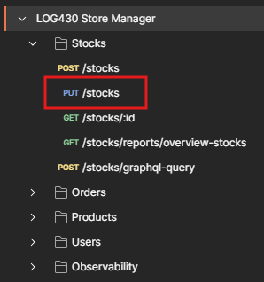
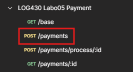

<div align="center">

<center>
<h1 style="font-size:18pt;">
Labo 06 – Orchestrateur Saga et Distributed Tracing
</h1>
</center>

<br>
<br>
<br>
<br>

<center>
<h2 style="font-size:16pt;">
PAR
</h2>
</center>

<br>
<br>

<center>
<h2 style="font-size:16pt;">
Marc CHARLEBOIS, CHAM65260301
</h2>
</center>

<br>
<br>
<br>
<br>
<br>
<br>

<center>
<h3 style="font-size:14pt;">
RAPPORT DE LABORATOIRE PRÉSENTÉ À MONSIEUR FABIO PETRILLO DANS LE CADRE DU COURS <em>ARCHITECTURE LOGICIELLE</em> (LOG430-01)
</h3>
</center>

<br>
<br>
<br>
<br>
<br>

<center>
<h3 style="font-size:14pt;">
MONTRÉAL, LE 4 NOVEMBRE 2025
</h3>
</center>

<br>
<br>
<br>
<br>
<br>

<center>
<h3 style="font-size:14pt;">
ÉCOLE DE TECHNOLOGIE SUPÉRIEURE<br>
UNIVERSITÉ DU QUÉBEC
</h3>
</center>

<br>
<br>
<br>
<br>
<br>

</div>

---
## **Tables des matières**
- [**Tables des matières**](#tables-des-matières)
  - [**Question 1**](#question-1)
  - [**Question 2**](#question-2)
  - [**Question 3**](#question-3)
  - [**Question 4**](#question-4)
  - [**Question 5**](#question-5)
  - [**Question 6**](#question-6)
  - [**CI/CD**](#cicd)

<br>

---

<div align="justify">

### **Question 1**

> Lequel de ces fichiers Python représente la logique de la machine à états décrite dans les diagrammes du document arc42? Est-ce que son implémentation est complète ou y a-t-il des éléments qui manquent? Illustrez votre réponse avec des extraits de code.

Le fichier `order_saga_controller.py` implémente bien la machine à états décrite dans le diagramme : c’est lui qui orchestré les transitions entre étapes en maintenant `self.current_saga_state` et en invoquant les handlers appropriés. La logique centrale apparaît dans la boucle suivante :

```Python
        while self.current_saga_state is not OrderSagaState.COMPLETED:
            if self.current_saga_state == OrderSagaState.CREATING_ORDER:
                self.current_saga_state = self.create_order_handler.run()
            elif self.current_saga_state == OrderSagaState.DECREASING_STOCK:
                self.increase_stock_handler = DecreaseStockHandler(order_data["items"])
                self.current_saga_state = self.increase_stock_handler.run()
            else:
                self.is_error_occurred = True
                self.logger.debug(f"L'état saga n'est pas valide : {self.current_saga_state}")
                self.current_saga_state = OrderSagaState.COMPLETED
```

Cependant, l’implémentation reste incomplète : plusieurs états clés du diagramme, comme `CREATING_PAYMENT` pour la création du paiement et les états de compensation `INCREASING_STOCK` et `CANCELLING_ORDER`, ne sont pas encore pris en charge. Aucune chaîne de rollback n’est orchestrée : en cas d’échec, le contrôleur ne déclenche pas les méthodes `rollback()` des étapes précédentes, ce qui empêche la compensation en ordre inverse. En conséquence, la saga fonctionne pour les deux premières transitions, mais ne couvre pas encore l’ensemble du cycle transactionnel prévu dans le diagramme d’états.

### **Question 2**

> Lequel de ces fichiers Python déclenche la création ou suppression des commandes? Est-ce qu'il accède à une base de données directement pour le faire? Illustrez votre réponse avec des extraits de code.

C’est le fichier `create_order_handler.py` qui déclenche la création et la suppression des commandes. Ce handler représente une étape concrète de la saga : il communique avec le Store Manager via l’API Gateway, mais **n’accède jamais directement à une base de données**. Toute interaction passe par des requêtes HTTP, comme le montrent les appels suivants :

```Python
response = requests.post(f'{config.API_GATEWAY_URL}/store-manager-api/orders',
    json=self.order_data,
    headers={'Content-Type': 'application/json'}
)
```

Ici, la méthode `run()` envoie une requête `POST` au service store-manager-api pour créer la commande. En cas d’erreur ou d’annulation, la méthode `rollback()` effectue une requête `DELETE` vers le même service pour supprimer la commande :

```Python
response = requests.delete(f'{config.API_GATEWAY_URL}/store-manager-api/orders/{self.order_id}')
```

### **Question 3**

> Quelle requête dans la collection Postman du Labo 05 correspond à l'endpoint appelé dans create_order_handler.py? Illustrez votre réponse avec des captures d'écran ou extraits de code.

L’endpoint appelé dans create_order_handler.py correspond à la requête `POST /store-manager-api/orders` de la collection Postman du Labo 05, utilisée pour créer une commande via l’API Gateway (ex: http://api-gateway:8080/store-manager-api/orders) :

```Python
response = requests.post(f'{config.API_GATEWAY_URL}/store-manager-api/orders',
    json=self.order_data,
    headers={'Content-Type': 'application/json'}
)
```


### **Question 4**

> Quel endpoint avez-vous appelé pour modifier le stock? Quelles informations de la commande avez-vous utilisées? Illustrez votre réponse avec des extraits de code.

Pour modifier le stock, j’ai appelé l’endpoint `PUT /store-manager-api/stocks` exposé par le Store Manager via l’API Gateway. Cette requête permet soit de diminuer le stock lors de la création de commande ("operation": "-"), soit de le rétablir en cas d’échec de paiement ("operation": "+"). Les informations utilisées proviennent directement de la commande, plus précisément de la liste des articles contenus dans `self.order_item_data`.


```Python
response = requests.put(
    f"{config.API_GATEWAY_URL}/store-manager-api/stocks",
    json={"items": self.order_item_data, "operation": "-"},
    headers={"Content-Type": "application/json"},
)
```
Et en cas d'erreur, voici le rollback :
```Python
response = requests.put(
    f"{config.API_GATEWAY_URL}/store-manager-api/stocks",
    json={"items": self.order_item_data, "operation": "+"},
    headers={"Content-Type": "application/json"},
)
```


### **Question 5**

> Quel endpoint avez-vous appelé pour générer une transaction de paiement? Quelles informations de la commande avez-vous utilisées? Illustrez votre réponse avec des extraits de code.

Pour créer la transaction de paiement, j’ai appelé l’endpoint `POST /payments` via l’API Gateway. Cette requête envoie un corps JSON contenant les informations de la commande : le `user_id`, le `order_id` et le `total_amount` précédemment récupéré à partir du service Store Manager:

```Python
response = requests.post(
    f"{config.API_GATEWAY_URL}/payments",
    json={
        "user_id": self.order_data["user_id"],
        "order_id": self.order_id,
        "amount": self.total_amount,
    },
    headers={"Content-Type": "application/json"},
)
```




### **Question 6**

> Quelle est la différence entre appeler l'orchestrateur Saga et appeler directement les endpoints des services individuels? Quels sont les avantages et inconvénients de chaque approche? Illustrez votre réponse avec des captures d'écran ou extraits de code.


### **CI/CD**

Mon pipeline CI/CD fonctionne ainsi : lors de chaque push ou pull request, mon script CI s’exécute sur GitHub Actions, lance un environnement avec MySQL et Redis, installe les dépendances et exécute les tests pour valider mon code. Si tout est correct, mon script CD se déclenche automatiquement via un runner self-hosted installé sur ma VM, qui récupère le dépôt, génère le fichier .env, construit et démarre les conteneurs avec Docker Compose, puis affiche l’état et les logs pour confirmer le déploiement.

On peut voir ci-dessous que les deux workflows se sont exécutés correctement, ce qui confirme que l’application a été testée puis déployée sans erreur.


Le déploiement s’effectue sur mon runner auto-hébergé configuré sur la VM, qui exécute directement les commandes Docker.


La commande `docker ps` montre que les conteneurs sont bien lancés sur la VM et que l’application est en fonctionnement.
